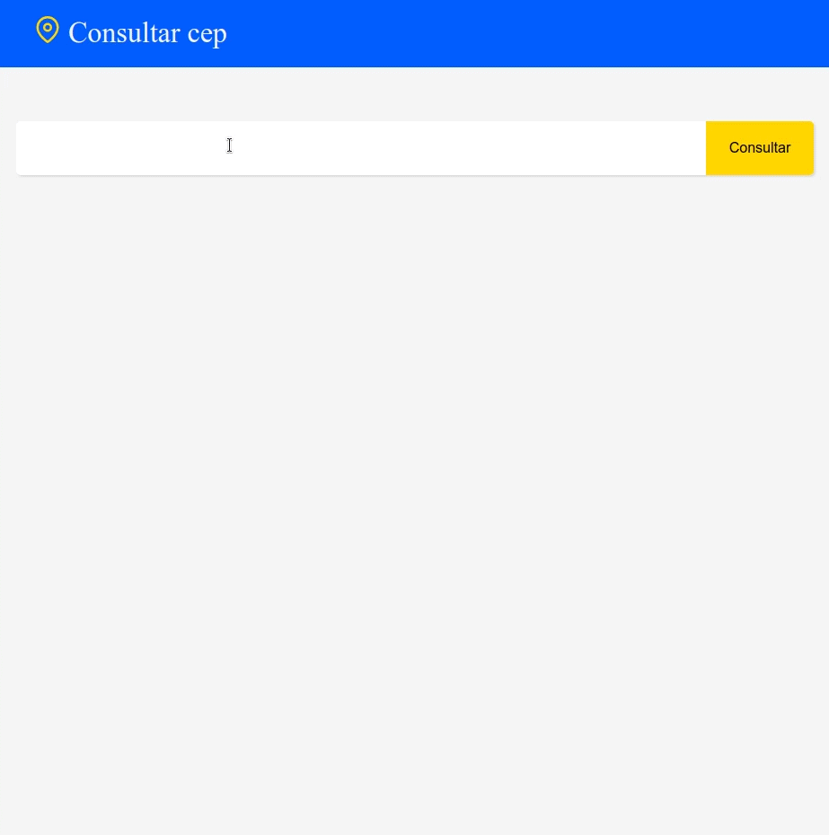
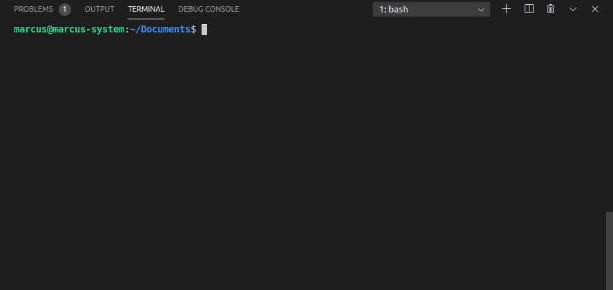
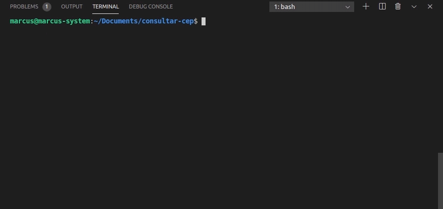

<h1 align="center">
  Consultar Cep
</h1>

<p align="center">Consulta de CEP criado com Reac.js e Typescript.</p>

##  Features

* Consulta CEP informando o endereço.
* [Postmon](https://postmon.com.br/) foi a API utilizada para a requisição.

<p align="center">
  
</p>

<p align="center">
  
</p>

## Installation

You may clone this repository.

```
  git clone git@github.com:marcuspereiradev/consultar-cep.git
```

<p align="center">
  
</p>

<br />

Inside the created directory run the scripts in order to execute the application.

```
  // Install the dependencies
  yarn install
```

<p align="center">
  
</p>

<br />

```
  // Start the application
  yarn start
```

<p align="center">
  
</p>

## License
This project is under MIT license. See the archive [LICENSE](LICENSE.md) to more details.

## Authors

|  [Marcus Pereira](https://github.com/marcuspereiradev)   |
